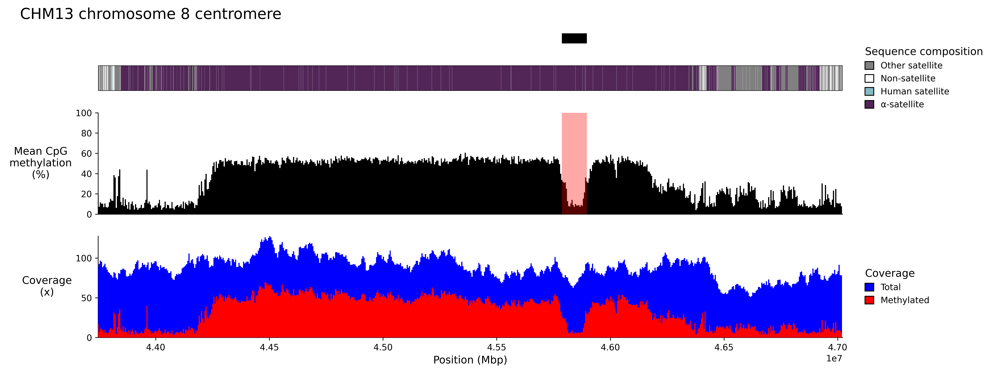

# CDR-Finder
[](https://github.com/koisland/CDR-Finder/actions/workflows/main.yaml)

This repository contains a snakemake to identify and quantify hypomethylated regions within centromeres, or Centromere Dip Regions (CDRs; Altemose et al., Science, 2022).



Original pipeline constructed by @arozanski97 with help from Glennis Logsdon

Adapted and distributed by @fkmastrorosa and @wharvey31

This is done by:
- Extracting the sequence of interest
- Intersect the sequence with its methylation data
- Bin the region of interest into 5 kbp windows and calculate their mean methylation percentage
- Run RepeatMasker on the sequence of interest to identify regions containing Alpha-satellite (ALR/Alpha)
- For each Alpha-satellite containing region, it identifies bins with a lower methylation percentage than the avearge of the region
- Merge consecutive bins
- Checks if flanking bins with greater than maximum methylation percentage (defined as within 1 standard deviation from the maximum)
- Checks if the CDR calls are smaller than a user-specified threshold


## Getting Started
```bash
git clone https://github.com/koisland/CDR-Finder
cd CDR-Finder
```

To setup with `conda`:
```bash
conda env create --name cdr_finder -f env.yaml
conda activate cdr_finder
```

If using `singularity`, only `snakemake` is required. This will create a python virtual environment and install `snakemake`.
```bash
python -m venv venv && source venv/bin/activate
pip install snakemake
```

## Usage
To run with `conda`.
```bash
snakemake -np --sdm conda -c 4
```

To run with `singularity`. This will use [`logsdonlab/cdr-finder`](https://hub.docker.com/r/logsdonlab/cdr-finder) to run the workflow.
```bash
snakemake -np --sdm apptainer conda  -c 4
```

Or alternatively to add as a workflow to an existing Snakefile.
```bash
git submodule add https://github.com/koisland/CDR-Finder
```

```python
# Pass CDR config here.
CDR_CONFIG = {}

module CDRFinder:
    snakefile:
        "CDR-Finder/workflow/Snakefile"
    config:
        CDR_CONFIG

use rule * from CDRFinder as cdr_*

rule all:
    input:
        rules.cdr_all.input
```

## Input
Multiple samples can be provided via the configfile. Each sample should contain the following:
- `fasta`
    * Genome assembly.
- `bamfile`
    * Alignment BAM file with methylation tags.
    * Requires aligned reads with the Mm and Ml tags (MM and ML also supported), and the reference sequence used for alignment.
    * https://github.com/epi2me-labs/modbam2bed?tab=readme-ov-file#usage
- `regions`
    * BED file of target region coordinates.

## Output
- `cdr_bed`
    * CDR regions.
    * Based on the mean methylation frequency across the region, identifies and bins regions into `config.window_size` with methylation frequency below mean spanning `config.report_threshold`.
    * `{config.output_dir}/bed/{sample}_CDR.bed`
- `cdr_plot`
    * CDR regions plotted with RepeatMasker annotations.
    * `{config.output_dir}/plot/{sample}_CDR.png`

## Parameters
|parameter|description|default|
|-|-|-|
|`window_size`|Size of the methylation windows to average over.|5000|
|`report_threshold`|Minimum size of CDR to report.|25000|
|`alr_threshold`|Size of ALR repeat stretches to include in search of CDR.|100000|
|`edge_search`| Distance to search on the edge of CDRs to ensure that methylation reaches max around.|50000|
|`low_threshold`|Threshold for mean percent methylation to clear in order for standard calling. If below, it is assumed that this is the low end of the distribution and the windows will be taken based on what is 1/2 a standard deviation above the mean.|39|

## Testing
Set up conda environment.
```bash
conda env create --name test_cdr_finder -f env_dev.yaml
```

To run the test case on chr8 and chr21.
```bash
snakemake -c 1 -p --sdm conda test/config/config.yaml
```

To run integration tests.
```bash
pytest -vvv
```

## Containerization
Requires `root` user and `docker`.
```bash
make docker
```

```bash
make singularity
```
