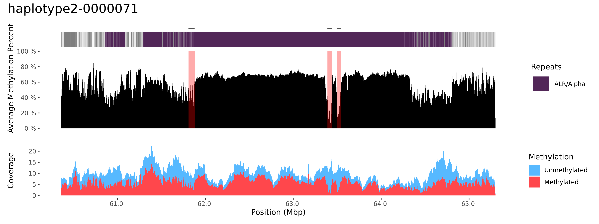
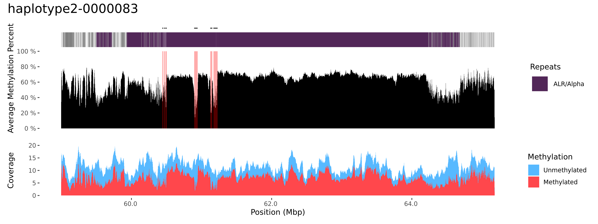
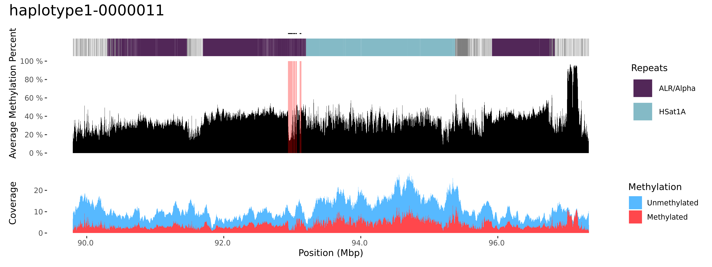
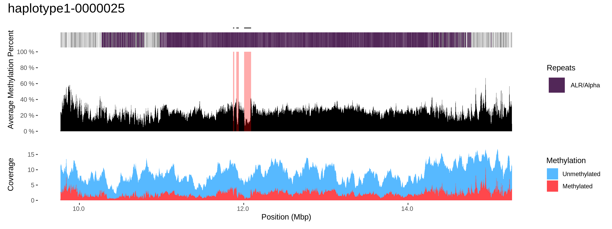

# Issues
CDR-Finder may fail to correctly call the correct regions. Choosing the correct set of parameters may fix similar scenarios.

### Pericentromeric/centromeric transition regions
Regions on the edges may get falsely called due to rapid changes in methylation.

Increasing `height_perc_valley_threshold` and `window_size` may reduce these cases by:
* Requiring deeper valleys. (`height_perc_valley_threshold`)
* Smoothing noisy peaks/valleys. (`window_size`)

### Low, uniform average methylation percent
Low and uniform average methylation percent may result in false calls.

With a `prom_perc_valley_threshold` of `0.2` and default parameters..

Increasing `prom_perc_valley_threshold` to `0.3` correctly ignores non-prominent CDRs.

### Smaller dip regions
These can be filtered by increasing the required height of a CDR.

With `height_perc_valley_threshold` of `0.34` and default parameters.

Requiring 60% of the median methylation average with `height_perc_valley_threshold` at `0.6` fixes this issue.

